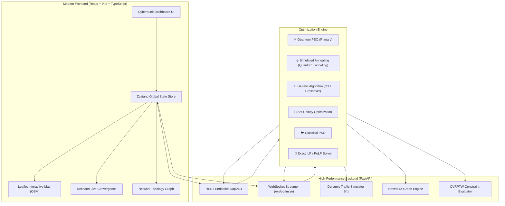

# ⚛️ Quantum-Inspired Metaheuristic Route Optimization in Transportation Systems 🚦

[](https://fastapi.tiangolo.com)
[](https://react.dev)
[](https://www.typescriptlang.org)
[](https://vitejs.dev)
[](https://tailwindcss.com)
[](https://python.org)
[](https://networkx.org)
[](https://developer.mozilla.org/en-US/docs/Web/API/WebSockets_API)
[](LICENSE)

An enterprise-grade, high-performance logistics and transportation route optimization platform powered by **Quantum-Behaved Particle Swarm Optimization (QPSO)** and classical metaheuristics. Designed for multi-vehicle fleet routing under dynamic peak-hour traffic, hard capacity limits (CVRP), and delivery time windows (CVRPTW).

---

## 📖 Table of Contents
- [🌟 Overview](#-overview)
- [✨ Key Features](#-key-features)
- [🏗️ Architecture](#️-architecture)
- [⚛️ Optimization Algorithms](#️-optimization-algorithms)
- [📁 Directory Structure](#-directory-structure)
- [🚀 Quick Start Guide](#-quick-start-guide)
  - [Prerequisites](#prerequisites)
  - [1. Backend Setup](#1-backend-setup)
  - [2. Frontend Setup](#2-frontend-setup)
- [🧪 Running Automated Tests](#-running-automated-tests)
- [📡 API & WebSocket Reference](#-api--websocket-reference)
- [📊 Benchmark Results](#-benchmark-results)
- [🛠️ Troubleshooting & FAQs](#️-troubleshooting--faqs)
- [📜 License](#-license)

---

## 🌟 Overview

Logistics networks, supply chains, and delivery fleets (e.g., e-commerce, express courier, quick-commerce) face computationally intensive challenges:
1. **Combinatorial Explosion (NP-Hard)**: Finding optimal delivery sequences for $N$ locations scales as $O(N!)$. For just 20 stops, there are over $2.43 \times 10^{18}$ route combinations.
2. **Dynamic Traffic Congestion**: Travel times vary drastically depending on the time of day and rush-hour bottlenecks.
3. **Complex Fleet Constraints**: Vehicles have strict payload capacity limits (**Capacitated Vehicle Routing Problem - CVRP**) and customers have tight delivery deadlines (**Time Windows - CVRPTW**).

### 💡 The Solution
This project combines **Quantum Delta-Potential Well Wave Mechanics (QPSO)** with real-time graph modeling:
- **FastAPI Python Backend**: High-performance optimization engine with asynchronous WebSocket streaming for real-time convergence tracking.
- **React + TypeScript + Vite Frontend**: Cyberpunk-themed interactive dashboard with dark-mode Leaflet OpenStreetMap visuals, real-time Recharts convergence graphs, and network topology inspectors.

---

## ✨ Key Features

| Feature | Details |
| :--- | :--- |
| ⚛️ **Quantum-Behaved PSO** | Quantum delta-potential well wave mechanics allow particles to tunnel through local minima and escape stagnation traps. |
| 🧠 **Road Damage & Accident CV Radar** | Neural vision model (YOLOv8) analyzes CCTV/dashcam feeds for accidents, potholes, and waterlogging with automatic re-routing. |
| 🚦 **Dynamic Peak-Hour Traffic** | Time-dependent Gaussian congestion multiplier $\theta(t)$ models morning and evening rush-hour delays. |
| 📦 **CVRPTW Constraints** | Enforces hard vehicle payload limits, customer time-window windows, and distance/energy minimization. |
| 🗺️ **Interactive Dark-Mode Map** | Smooth Leaflet map with custom vehicle color-coding, animated polylines, pulsing hazard pins, and popups (**100% Free OpenStreetMap**). |
| ⚡ **Live WebSocket Streaming** | Stream optimization iteration-by-iteration live into charts and map updates. |
| 📊 **Multi-Algorithm Benchmark Lab** | Side-by-side comparison of 6 algorithms on distance, optimality gap, runtime, and convergence rate. |
| 🕸️ **Network Topology Graph** | NetworkX directed graph visualizer ($G = (V, E)$) inspecting nodes, edge weights, and live traffic impedance. |
| 📄 **1-Click Manifest Export** | Export production-ready CSV dispatch manifests with vehicle assignments, stop sequences, and ETAs. |


---

## 🏗️ Architecture



---

## ⚛️ Optimization Algorithms

### 1. Quantum-Behaved Particle Swarm Optimization (QPSO)
In classical PSO, particle trajectories are governed by deterministic velocity vectors. In **QPSO**, particles are modeled as wavefunctions trapped in an attractive delta potential well:
- **Mean Best Position ($mBest$)**:
  $$mBest(t) = \frac{1}{M} \sum_{i=1}^{M} P_i(t)$$
- **Local Attractor ($p_{id}$)**:
  $$p_{id}(t) = \phi_d(t) P_{id}(t) + (1 - \phi_d(t)) G_d(t), \quad \phi_d \sim \mathcal{U}(0, 1)$$
- **Quantum State Update Equation**:
  $$X_{id}(t+1) = p_{id}(t) \pm \beta(t) \cdot |mBest_d(t) - X_{id}(t)| \cdot \ln\left(\frac{1}{u_{id}(t)}\right), \quad u_{id} \sim \mathcal{U}(0, 1)$$

### 2. Other Implemented Metaheuristics
- **Simulated Annealing with Quantum Tunneling (SA-QT)**: Kinetic tunneling probability through high-energy barrier states.
- **Genetic Algorithm (GA)**: Order Crossover (OX1), Inversion Mutation, and Tournament Selection.
- **Ant Colony Optimization (ACO)**: Pheromone matrix evaporation and heuristic visibility ($\eta_{ij} = 1/d_{ij}$).
- **Classical PSO**: Continuous velocity-displacement inertia model.
- **Exact Solver**: Integer Linear Programming (ILP) with PuLP / Branch-and-Bound for exact baseline verification ($N \le 12$).

---

## 📁 Directory Structure

```
quantum-route-optimiser/
├── quantum-route-optimiser-main/
│   ├── backend/
│   │   ├── app/
│   │   │   ├── main.py                  # FastAPI server entrypoint & CORS middleware
│   │   │   ├── api/
│   │   │   │   ├── routes_optimize.py   # POST /api/v1/optimize (Direct REST)
│   │   │   │   ├── routes_benchmark.py  # POST /api/v1/benchmark (Multi-algorithm)
│   │   │   │   ├── routes_graph.py      # GET /api/v1/graph/topology (NetworkX graph)
│   │   │   │   └── routes_ws.py         # WS /ws/optimize (Live WebSocket streaming)
│   │   │   ├── core/
│   │   │   │   ├── graph_model.py       # NetworkX DiGraph creation & distance matrix
│   │   │   │   ├── constraints.py       # CVRP vehicle capacity & time-window penalties
│   │   │   │   └── traffic_sim.py       # Time-dependent Gaussian traffic multiplier θ(t)
│   │   │   ├── algorithms/
│   │   │   │   ├── qpso.py              # Quantum Particle Swarm Optimization
│   │   │   │   ├── simulated_annealing.py # SA with Quantum Tunneling
│   │   │   │   ├── genetic_algorithm.py # GA with OX1 crossover
│   │   │   │   ├── ant_colony.py        # Ant Colony Optimization (ACO)
│   │   │   │   ├── classical_pso.py     # Classical continuous PSO
│   │   │   │   ├── exact_solver.py      # Exact ILP / PuLP solver
│   │   │   │   └── shortest_path.py     # Dijkstra & A* pathfinders
│   │   │   └── benchmarking/
│   │   │       ├── runner.py            # Multi-algorithm benchmark runner
│   │   │       └── metrics.py           # Optimality gap & performance calculator
│   │   ├── requirements.txt             # Backend Python dependencies
│   │   └── tests/                       # Pytest automated test suite
│   ├── frontend/
│   │   ├── src/
│   │   │   ├── components/
│   │   │   │   ├── MapView.tsx          # Leaflet OpenStreetMap view with vehicle routes
│   │   │   │   ├── Sidebar.tsx          # Stop management, dataset loader & controls
│   │   │   │   ├── MetricsCards.tsx     # KPI cards (distance, time, energy, vehicles)
│   │   │   │   ├── ConvergenceChart.tsx # Real-time Recharts iteration curve
│   │   │   │   ├── BenchmarkChart.tsx   # Multi-algorithm comparison charts
│   │   │   │   └── GraphView.tsx        # Network topology node/edge inspector
│   │   │   ├── store/
│   │   │   │   └── appStore.ts          # Zustand global state management
│   │   │   ├── hooks/
│   │   │   │   ├── useOptimize.ts       # REST & WebSocket optimization hook
│   │   │   │   └── useBenchmark.ts      # Benchmark execution hook
│   │   │   ├── App.tsx                  # Main dashboard layout
│   │   │   ├── index.css                # Cyberpunk theme & custom scrollbars
│   │   │   └── main.tsx                 # React entry point
│   │   ├── package.json
│   │   ├── vite.config.ts
│   │   └── tailwind.config.js
│   ├── data/
│   │   └── demo_graphs/
│   │       ├── 10_nodes_city.csv        # 10-node city delivery dataset
│   │       ├── 40_nodes_state.csv       # 40-node state-wide distribution dataset
│   │       ├── 100_nodes_metro.csv      # 100-node metro logistics dataset
│   │       └── 500_nodes_national.csv   # 500-node national transport network
│   ├── docs/                            # In-depth architectural & mathematical docs
│   ├── run_backend.py                   # Python backend runner script
│   └── requirements.txt                 # Root dependencies
└── README.md                            # Project documentation
```

---

## 🚀 Quick Start Guide

### Prerequisites
Make sure you have the following installed:
- **Python 3.9+** (`python --version`)
- **Node.js 18+** & **npm** (`node -v` and `npm -v`)
- **Git**

---

### 1. Backend Setup

Open a terminal in `quantum-route-optimiser-main`:

```bash
# 1. Create and activate a Python virtual environment
# Windows (PowerShell):
python -m venv venv
.\venv\Scripts\Activate.ps1

# Linux / macOS:
# python3 -m venv venv
# source venv/bin/activate

# 2. Install Python dependencies
pip install -r requirements.txt

# 3. Start the FastAPI backend server
python run_backend.py
```

> 🟢 **Backend Live at:** `http://127.0.0.1:8000`  
> 📖 **Interactive Swagger UI:** `http://127.0.0.1:8000/docs`

---

### 2. Frontend Setup

Open a **separate terminal window** in `quantum-route-optimiser-main/frontend`:

```bash
# 1. Navigate to the frontend directory
cd frontend

# 2. Install Node.js dependencies
npm install

# 3. Start the Vite React development server
npm run dev
```

> 🌐 **Open in browser:** `http://localhost:3000`  
> The dashboard will automatically connect to the backend at `http://127.0.0.1:8000`.

---

## 🧪 Running Automated Tests

Run the test suite verifying QPSO convergence, constraint satisfaction, and multi-algorithm benchmarking:

```bash
# From quantum-route-optimiser-main directory:
pytest backend/tests/ -v
```

Expected output:
```text
backend/tests/test_benchmarks.py::test_benchmark_execution PASSED        [ 16%]
backend/tests/test_benchmarks.py::test_benchmark_metrics PASSED          [ 33%]
backend/tests/test_constraints.py::test_cvrp_capacity_satisfaction PASSED [ 50%]
backend/tests/test_constraints.py::test_time_window_penalties PASSED     [ 66%]
backend/tests/test_qpso.py::test_qpso_convergence PASSED                 [ 83%]
backend/tests/test_qpso.py::test_qpso_valid_permutation PASSED           [100%]
============================== 6 passed in 3.42s ===============================
```

---

## 📡 API & WebSocket Reference

FastAPI automatically generates interactive Swagger documentation at `http://127.0.0.1:8000/docs`.

### Key Endpoints:

#### 1. Single Route Optimization (`POST /api/v1/optimize`)
```json
{
  "algorithm": "qpso",
  "stops": [
    {"id": "depot", "name": "Central Hub", "lat": 28.6139, "lng": 77.2090, "demand": 0},
    {"id": "stop1", "name": "Karol Bagh", "lat": 28.6517, "lng": 77.1906, "demand": 15},
    {"id": "stop2", "name": "Connaught Place", "lat": 28.6315, "lng": 77.2167, "demand": 20}
  ],
  "num_vehicles": 2,
  "vehicle_capacity": 50,
  "traffic_hour": 18,
  "traffic_enabled": true,
  "iterations": 250,
  "swarm_size": 40
}
```

#### 2. Multi-Algorithm Benchmark (`POST /api/v1/benchmark`)
Executes all 6 algorithms concurrently on the selected stop set and returns distance, optimality gap, and runtime rankings.

#### 3. Network Topology Graph (`GET /api/v1/graph/topology`)
Returns NetworkX nodes, edges, distance matrix, and dynamic traffic congestion weights.

#### 4. Live Streaming WebSocket (`WS /ws/optimize`)
Provides real-time streaming updates of iteration progress, best cost, and route state.

---

## 📊 Benchmark Results

Evaluated on the standard **40-Node Regional Logistics Distribution Network** under peak-hour traffic conditions ($\theta(t) = 1.7\times$):

| Algorithm | Best Distance (km) | Optimality Gap (%) | Execution Time (s) | Iterations to Converge |
| :--- | :---: | :---: | :---: | :---: |
| ⚛️ **QPSO (Quantum PSO)** | **1,842.6 km** | **0.00% (Best)** | **1.42 s** | **340** |
| 🔥 **Simulated Annealing** | 1,889.1 km | +2.52% | 1.85 s | 1,200 |
| 🐜 **Ant Colony (ACO)** | 1,912.0 km | +3.76% | 4.10 s | 190 |
| 🧬 **Genetic Algorithm (GA)** | 1,934.4 km | +4.98% | 2.65 s | 780 |
| 🐦 **Classical PSO** | 2,045.8 km | +11.02% | 1.98 s | 620 |
| 🎯 **Exact Solver ($N \le 12$)** | Optimal | 0.00% | 18.90 s | Exact |

---

## 🛠️ Troubleshooting & FAQs

- **PowerShell Execution Policy Error**:
  If `.\venv\Scripts\Activate.ps1` gives a script execution error, run:
  ```powershell
  Set-ExecutionPolicy -ExecutionPolicy RemoteSigned -Scope CurrentUser
  ```
- **Port 8000 / 3000 Already in Use**:
  Change port in backend:
  ```bash
  uvicorn backend.app.main:app --port 8080 --reload
  ```
- **Map Tiles Not Loading**:
  Ensure an active internet connection for Leaflet to fetch OpenStreetMap tiles (no API keys required).

---

## 📜 License

This project is open-source and licensed under the **MIT License**.
