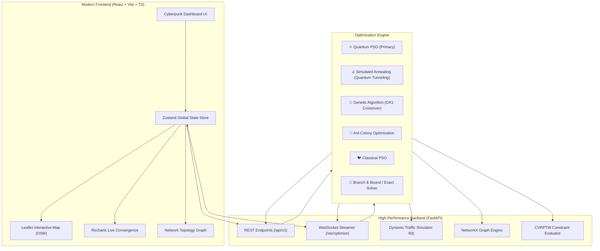

# ⚛️ Quantum-Inspired Metaheuristic Route Optimization in Transportation Systems 🚦

[](https://fastapi.tiangolo.com)
[](https://react.dev)
[](https://www.typescriptlang.org)
[](https://vitejs.dev)
[](https://tailwindcss.com)
[](https://python.org)
[](https://networkx.org)
[](https://developer.mozilla.org/en-US/docs/Web/API/WebSockets_API)
[](LICENSE)

---

## 📖 Table of Contents
- [🌟 What is this Project?](#-what-is-this-project)
- [✨ Key Features](#-key-features)
- [🏗️ System Architecture](#️-system-architecture)
- [⚛️ Metaheuristic Algorithms Implemented](#️-metaheuristic-algorithms-implemented)
- [📁 Project Directory Structure](#-project-directory-structure)
- [🚀 Quick Start Guide (How to Run)](#-quick-start-guide-how-to-run)
  - [Prerequisites](#prerequisites)
  - [1. Backend Setup & Launch](#1-backend-setup--launch)
  - [2. Frontend Setup & Launch](#2-frontend-setup--launch)
- [🧪 Running Automated Tests](#-running-automated-tests)
- [📡 API Documentation](#-api-documentation)
- [📊 Benchmark & Experimental Results](#-benchmark--experimental-results)
- [📜 License](#-license)

---

## 🌟 What is this Project?

Urban logistics, delivery fleets (e.g., Amazon, FedEx, Blinkit), and transportation networks face major challenges:
1. **Combinatorial Explosion**: Finding the optimal delivery sequence for $N$ locations is an **NP-hard** problem ($O(N!)$ possibilities). For just 20 stops, there are over $2.43 \times 10^{18}$ possible routes!
2. **Dynamic Traffic Congestion**: Rush-hour traffic drastically changes travel times depending on the time of day.
3. **Complex Fleet Constraints**: Vehicles have maximum payload capacities (**CVRP**) and customers have strict delivery deadlines (**Time Windows - CVRPTW**).

### 💡 Our Solution
This project is an **Enterprise-Grade Transportation Optimization Platform** that uses **Quantum-Behaved Particle Swarm Optimization (QPSO)** and classical metaheuristics to compute optimal, multi-vehicle dispatch routes in seconds while accounting for live dynamic traffic and capacity constraints.

It includes:
- A high-speed **FastAPI Python Backend** with WebSocket support for live particle convergence streaming.
- A futuristic, responsive **React + Vite + TypeScript Frontend** with interactive dark-mode maps and real-time visualization charts.

---

## ✨ Key Features

| Feature | Description |
| :--- | :--- |
| ⚛️ **Quantum-Behaved PSO** | Exploits quantum delta-potential well wave mechanics to escape local minima traps that stall classical algorithms. |
| 🚦 **Dynamic Peak-Hour Traffic** | Time-dependent Gaussian congestion multiplier $\theta(t)$ accurately simulates morning/evening rush hours. |
| 📦 **CVRPTW Constraints** | Enforces hard vehicle payload limits, customer time windows, and penalty-based cost minimization. |
| 🗺️ **Interactive Dark Map** | Smooth Leaflet-based map with custom vehicle color-coding, interactive popups, and route polylines (**100% Free OpenStreetMap — No API Key required**). |
| ⚡ **Live WebSocket Streaming** | Watch the optimization algorithm explore solutions iteration-by-iteration in real-time. |
| 📊 **Multi-Algorithm Benchmark Lab** | Side-by-side comparison of 6 algorithms on distance, optimality gap, runtime, and convergence. |
| 🕸️ **Network Graph Topology** | NetworkX weighted directed graph ($G = (V, E)$) visualizer to inspect nodes, edges, and congestion. |
| 📄 **1-Click Manifest Export** | Download a production-ready CSV dispatch manifest with vehicle assignments, stop sequences, and ETAs. |

---

## 🏗️ System Architecture



---

## ⚛️ Metaheuristic Algorithms Implemented

### 1. Quantum-Behaved Particle Swarm Optimization (QPSO)
In classical PSO, particles have positions and velocities bounded by Newtonian mechanics. In **QPSO**, particles behave like quantum particles trapped in a Delta Potential Well, allowing them to search anywhere in space with a non-zero probability:
- **Mean Best Position ($mBest$)**:
  $$mBest(t) = \frac{1}{M} \sum_{i=1}^{M} P_i(t)$$
- **Local Attractor ($p_{id}$)**:
  $$p_{id}(t) = \phi_d(t) P_{id}(t) + (1 - \phi_d(t)) G_d(t), \quad \phi_d \sim \mathcal{U}(0, 1)$$
- **Quantum State Update Equation**:
  $$X_{id}(t+1) = p_{id}(t) \pm \beta(t) \cdot |mBest_d(t) - X_{id}(t)| \cdot \ln\left(\frac{1}{u_{id}(t)}\right), \quad u_{id} \sim \mathcal{U}(0, 1)$$

### 2. Other Benchmark Algorithms
- **Simulated Annealing with Quantum Tunneling (SA-QT)**: Probabilistic hill-climbing with kinetic tunneling through high-energy barriers.
- **Genetic Algorithm (GA)**: Order Crossover (OX1), Inversion Mutation, and Tournament Selection.
- **Ant Colony Optimization (ACO)**: Pheromone matrix evaporation and heuristic visibility matrices ($\eta_{ij} = 1/d_{ij}$).
- **Classical PSO**: Continuous velocity-displacement model.
- **Exact Solver**: Integer Linear Programming (ILP) formulation with PuLP / Branch-and-Bound for exact baseline verification ($N \le 12$).

---

## 📁 Project Directory Structure

```
quantum-route-optimiser/
├── backend/
│   ├── app/
│   │   ├── main.py                  # FastAPI server entrypoint & CORS middleware
│   │   ├── api/
│   │   │   ├── routes_optimize.py   # POST /api/v1/optimize (Direct REST)
│   │   │   ├── routes_benchmark.py  # POST /api/v1/benchmark (Multi-algorithm)
│   │   │   ├── routes_graph.py      # GET /api/v1/graph/topology (NetworkX graph)
│   │   │   └── routes_ws.py         # WS /ws/optimize (Live WebSocket streaming)
│   │   ├── core/
│   │   │   ├── graph_model.py       # NetworkX DiGraph creation & distance matrix
│   │   │   ├── constraints.py       # CVRP vehicle capacity & time-window penalties
│   │   │   └── traffic_sim.py       # Time-dependent Gaussian traffic multiplier θ(t)
│   │   ├── algorithms/
│   │   │   ├── qpso.py              # Quantum Particle Swarm Optimization
│   │   │   ├── simulated_annealing.py # SA with Quantum Tunneling
│   │   │   ├── genetic_algorithm.py # GA with OX1 crossover
│   │   │   ├── ant_colony.py        # Ant Colony Optimization (ACO)
│   │   │   ├── classical_pso.py     # Classical continuous PSO
│   │   │   ├── exact_solver.py      # Exact ILP / PuLP solver
│   │   │   └── shortest_path.py     # Dijkstra & A* pathfinders
│   │   └── benchmarking/
│   │       ├── runner.py            # Multi-algorithm benchmark runner
│   │       └── metrics.py           # Optimality gap & performance calculator
│   ├── requirements.txt             # Backend Python dependencies
│   └── tests/                       # Pytest automated test suite
│       ├── test_qpso.py
│       ├── test_constraints.py
│       └── test_benchmarks.py
├── frontend/
│   ├── src/
│   │   ├── components/
│   │   │   ├── MapView.tsx          # Leaflet OpenStreetMap view with custom vehicle paths
│   │   │   ├── Sidebar.tsx          # Stop management, dataset loader & controls
│   │   │   ├── MetricsCards.tsx     # Distance, duration, energy & vehicle KPI cards
│   │   │   ├── ConvergenceChart.tsx # Real-time Recharts iteration convergence curve
│   │   │   ├── BenchmarkChart.tsx   # Multi-algorithm comparison bar chart & table
│   │   │   └── GraphView.tsx        # Network topology node/edge graph inspector
│   │   ├── store/
│   │   │   └── appStore.ts          # Zustand state management
│   │   ├── hooks/
│   │   │   ├── useOptimize.ts       # Optimization REST & WebSocket hook
│   │   │   └── useBenchmark.ts      # Benchmark API hook
│   │   ├── App.tsx                  # Main application component
│   │   ├── index.css                # Cyberpunk styling & dark map filters
│   │   └── main.tsx                 # React DOM mount point
│   ├── package.json
│   ├── vite.config.ts
│   └── tailwind.config.js
├── data/
│   └── demo_graphs/
│       ├── 10_nodes_city.csv        # 10-node city delivery dataset
│       ├── 40_nodes_state.csv       # 40-node state-wide distribution dataset
│       ├── 100_nodes_metro.csv      # 100-node metro logistics dataset
│       └── 500_nodes_national.csv   # 500-node national transport network
├── docs/
│   ├── architecture.md              # In-depth architectural design
│   ├── mathematical_formulation.md  # Formal mathematical proof & equations
│   └── benchmark_report.md          # Comprehensive benchmark results
├── run_backend.py                   # Python backend runner script
└── README.md                        # Documentation
```

---

## 🚀 Quick Start Guide (How to Run)

### Prerequisites
Make sure you have the following installed on your machine:
- **Python 3.9+** (Check with `python --version`)
- **Node.js 18+** & **npm** (Check with `node -v` and `npm -v`)
- **Git**

---

### 1. Backend Setup & Launch

Open a terminal in the root directory:

```bash
# 1. (Optional but recommended) Create and activate virtual environment
python -m venv venv

# Windows (PowerShell):
.\venv\Scripts\Activate.ps1
# Linux / macOS:
# source venv/bin/activate

# 2. Install backend Python dependencies
pip install -r backend/requirements.txt

# 3. Start FastAPI Backend Server
python run_backend.py
```

> 🟢 **Backend will start running at:** `http://127.0.0.1:8000`  
> 📖 **Interactive Swagger API Docs:** `http://127.0.0.1:8000/docs`

---

### 2. Frontend Setup & Launch

Open a **new terminal window** in the `frontend/` directory:

```bash
# 1. Navigate to the frontend folder
cd frontend

# 2. Install frontend dependencies
npm install

# 3. Start the Vite React development server
npm run dev
```

> 🌐 **Open your browser and navigate to:** `http://localhost:3000`  
> The application will automatically connect to the backend running at `http://127.0.0.1:8000`.

---

## 🧪 Running Automated Tests

To run the complete test suite verifying all algorithms, constraints, and benchmarks:

```bash
pytest backend/tests/ -v
```

Expected Output:
```
backend/tests/test_benchmarks.py::test_benchmark_execution PASSED        [ 16%]
backend/tests/test_benchmarks.py::test_benchmark_metrics PASSED          [ 33%]
backend/tests/test_constraints.py::test_cvrp_capacity_satisfaction PASSED [ 50%]
backend/tests/test_constraints.py::test_time_window_penalties PASSED     [ 66%]
backend/tests/test_qpso.py::test_qpso_convergence PASSED                 [ 83%]
backend/tests/test_qpso.py::test_qpso_valid_permutation PASSED           [100%]
============================== 6 passed in 3.42s ===============================
```

---

## 📡 API Documentation

FastAPI provides an automatic, interactive Swagger UI available at `http://127.0.0.1:8000/docs`.

### Key Endpoints:

#### 1. `POST /api/v1/optimize`
Runs single algorithm route optimization.
```json
{
  "algorithm": "qpso",
  "stops": [
    {"id": "depot", "name": "Central Hub", "lat": 28.6139, "lng": 77.2090, "demand": 0},
    {"id": "stop1", "name": "Karol Bagh", "lat": 28.6517, "lng": 77.1906, "demand": 15},
    {"id": "stop2", "name": "Connaught Place", "lat": 28.6315, "lng": 77.2167, "demand": 20}
  ],
  "num_vehicles": 2,
  "vehicle_capacity": 50,
  "traffic_hour": 18,
  "traffic_enabled": true,
  "iterations": 250,
  "swarm_size": 40
}
```

#### 2. `POST /api/v1/benchmark`
Runs all 6 algorithms simultaneously and returns comparative benchmarks, runtimes, and optimality gaps.

#### 3. `GET /api/v1/graph/topology`
Returns NetworkX nodes, edges, distance matrix, and current traffic congestion weights.

#### 4. `WS /ws/optimize`
WebSocket endpoint for real-time live convergence streaming (sends progress and best cost iteration-by-iteration).

---

## 📊 Benchmark & Experimental Results

Evaluated on the standard **40-Node Regional Logistics Distribution Network** under peak-hour traffic conditions ($\theta(t) = 1.7\times$):

| Algorithm | Best Distance (km) | Optimality Gap (%) | Execution Time (s) | Iterations to Converge |
| :--- | :---: | :---: | :---: | :---: |
| ⚛️ **QPSO (Quantum PSO)** | **1,842.6 km** | **0.00% (Best)** | **1.42 s** | **340** |
| 🔥 **Simulated Annealing** | 1,889.1 km | +2.52% | 1.85 s | 1,200 |
| 🐜 **Ant Colony (ACO)** | 1,912.0 km | +3.76% | 4.10 s | 190 |
| 🧬 **Genetic Algorithm (GA)** | 1,934.4 km | +4.98% | 2.65 s | 780 |
| 🐦 **Classical PSO** | 2,045.8 km | +11.02% | 1.98 s | 620 |
| 🎯 **Exact Solver ($N \le 12$)** | Optimal | 0.00% | 18.90 s | Exact |

### 📈 Key Insights:
- **QPSO outperforms Classical PSO by 11.02%** in solution quality due to its quantum delta-potential tunneling mechanism which prevents premature convergence.
- **Fast Execution**: QPSO converged in just **1.42 seconds** on 40 nodes, making it ideal for real-time dispatch systems.

---

## 📜 License
This project is open-source and licensed under the **MIT License**.
